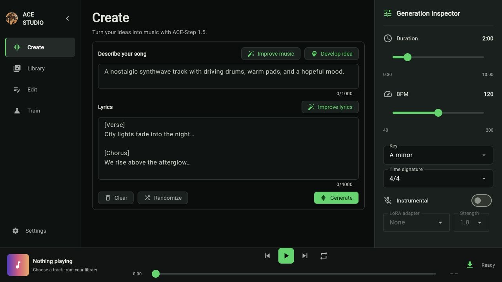
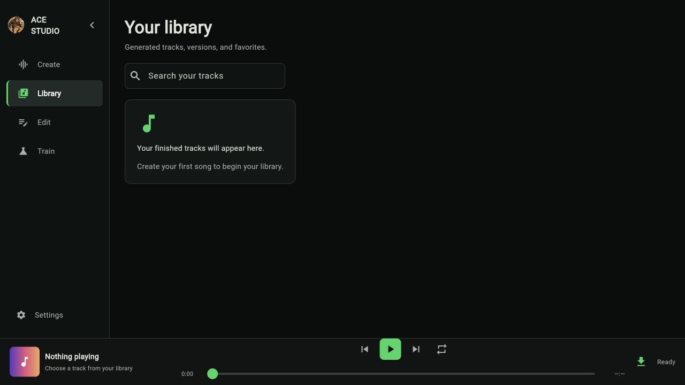
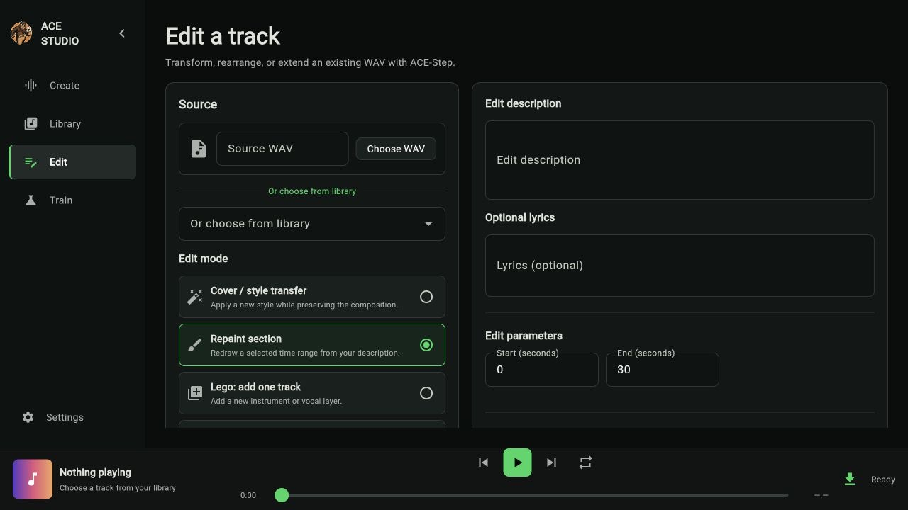
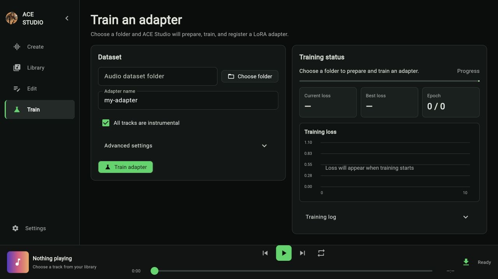
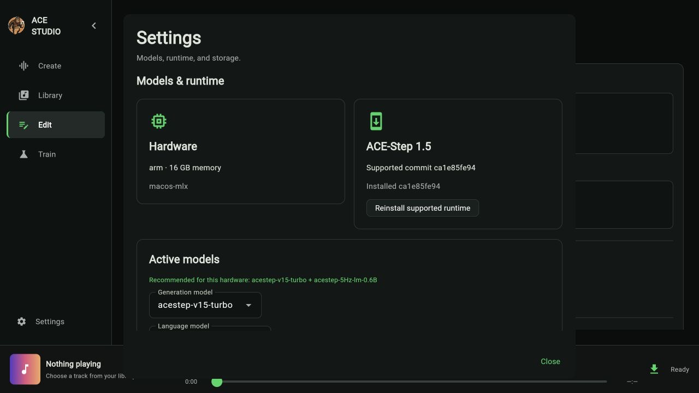

<h1 align="center"> ACE Studio</h1>

**Create music locally with [ACE-Step 1.5](https://github.com/ace-step/ACE-Step-1.5).**

ACE Studio is a desktop client for turning a musical idea, lyrics, and a few musical constraints into generated audio. It manages the ACE-Step runtime and models on your machine, chooses a suitable hardware profile, and keeps finished tracks in a searchable local library.

> Your prompts, runtime, models, and generated music stay on your computer. Internet access is needed only to download ACE-Step, its dependencies, and models.

## Download

Download the installer for your platform from [GitHub Releases](https://github.com/alvarolorentedev/ace-studio/releases):

- macOS: DMG
- Windows: installer EXE
- Debian/Ubuntu: `.deb` package

Release installers are unsigned. Your operating system may ask you to explicitly allow the app during installation.

## What you can do

- Generate songs from a text description, with optional lyrics.
- Set duration (30 seconds–10 minutes), BPM, key, time signature, instrumental mode, seed, guidance, and up to four versions per run.
- Use ACE-Step’s language model to improve a music prompt or lyric draft, develop a short idea, or start from a random prompt.
- Edit WAV tracks with cover, repaint, LEGO, extract, and complete workflows, then save the result to your library.
- Prepare raw-audio datasets, train LoRA or LoKr adapters, and load exported adapters for generation.
- Play generated tracks in the app, save a copy, search your library, rename tracks, and mark favorites.
- Let ACE Studio detect Apple Silicon, NVIDIA, AMD, Intel, or CPU-only hardware and install a matching ACE-Step runtime.
- Select and download alternate generation and language models from Settings, and reinstall the pinned supported ACE-Step runtime without replacing a working runtime unless its compatibility probe passes.

## First launch

1. Open ACE Studio and review the detected hardware profile and recommended models.
2. Select **Install ACE-Step**.
3. Wait while the app downloads the supported ACE-Step revision, creates an isolated runtime, installs dependencies, and downloads the recommended model(s).
4. Enter a music description (and optionally lyrics) on **Create**, then select **Generate**.

The first setup can take several minutes and multiple gigabytes, depending on the selected models and connection. Later launches reuse the installed runtime and models.

## Using ACE Studio

### Create

Turn an idea into music. Describe the sound, mood, instruments, and arrangement; add structured lyrics for vocals or choose **Instrumental**. The inspector controls duration, BPM, key, time signature, versions, seed, and guidance. Generation shows live progress and can be stopped at any time.

With a language model installed, use **Improve music**, **Improve lyrics**, or **Develop idea** to turn a rough starting point into a fuller song brief.



### Library

Every completed version is copied into the local library automatically. Play tracks, search by title or prompt, favorite them, rename or delete them, and save a copy through the player’s download button.



### Edit

Choose a WAV file or a track from your library, then run cover, repaint, LEGO, extract, or complete/extend. Repaint accepts a target time range, cover exposes source-preservation strength, and the track-aware modes let you select instruments. LEGO, extract, and complete require a Base-family generation model.



### Train

Choose a raw-audio folder, then select **Train adapter**. ACE Studio scans and saves the dataset, auto-labels unlabeled tracks when a language model is selected, preprocesses tensors, trains a LoRA adapter, and registers it for Settings. LoKr and manual hyperparameters remain available in **Advanced settings**; progress, failures, and metadata review stay on the same screen.



### Settings

See the detected hardware, download supported models, choose active generation and language models, manage adapters, and reinstall the pinned ACE-Step revision. Reinstalls are staged and probed before activation, so a failure leaves the existing runtime active.



## Local data

ACE Studio stores its runtime, downloaded models, generated audio, library database, training data, and logs in the following location by default:

| Platform | Location |
| --- | --- |
| macOS | `~/Library/Application Support/ACE Studio` |
| Windows | `%LOCALAPPDATA%\\ACE Studio` |
| Linux | `${XDG_DATA_HOME:-~/.local/share}/ace-studio` |

Set `ACE_STUDIO_DATA_DIR` before launching the app to use a different location.

## Run from source

### Requirements

- macOS, Windows, or Linux
- [Python 3.12](https://www.python.org/downloads/)
- [uv](https://docs.astral.sh/uv/getting-started/installation/)
- A supported accelerator is recommended. Apple Silicon uses MLX; Windows and Linux can use NVIDIA CUDA, AMD ROCm, or Intel XPU when detected. CPU fallback is available on Windows and Linux, but generation will be substantially slower.

Clone the repository, then install the app environment and start it:

```bash
git clone https://github.com/alvarolorentedev/ace-studio.git
cd ace-studio
make install
make run
```

`make install` creates a local `.venv` with Python 3.12 and installs ACE Studio. `make run` opens the desktop application.

If you already have the repository, the short path is:

```bash
make run
```

## Development commands

```bash
make help       # list available commands
make run-web    # run the development UI in a browser
make test       # run tests and enforce branch coverage
make check      # run tests, Ruff, compile checks, and diff whitespace checks
```

To build a local application bundle, first stage the packaged runtime and then use the platform target:

```bash
make build-macos
make build-windows
make build-linux
```

## Troubleshooting

- **Setup fails or is slow:** confirm that you have a working internet connection and enough free disk space for dependencies and models; retry **Install ACE-Step** from the setup screen.
- **Generation is slow:** use a supported GPU or Apple Silicon when possible. CPU mode works as a fallback but is intended for compatibility, not fast generation.
- **A model cannot be selected:** download it first in **Settings**; only installed models can become active.
- **Need a clean local install:** close ACE Studio, remove or rename its data directory above, then launch and install again. This also removes locally stored models and music unless you back them up first.

## Credits and licensing

ACE Studio is distributed under the [license in this repository](LICENSE). ACE-Step is downloaded from its [official repository](https://github.com/ace-step/ACE-Step-1.5) and retains its upstream license. Model downloads are subject to their respective licenses.
